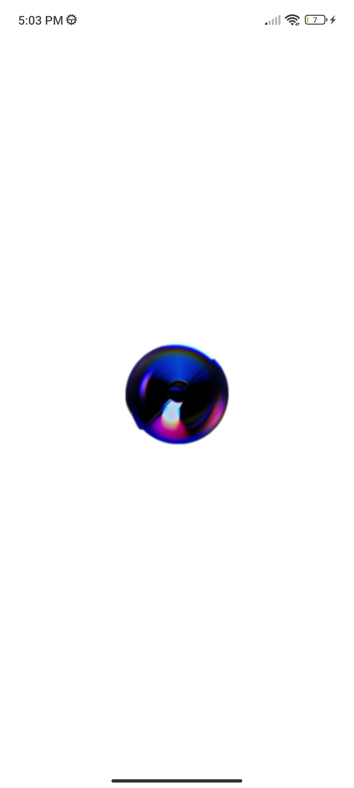
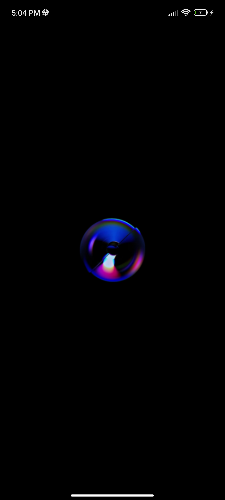
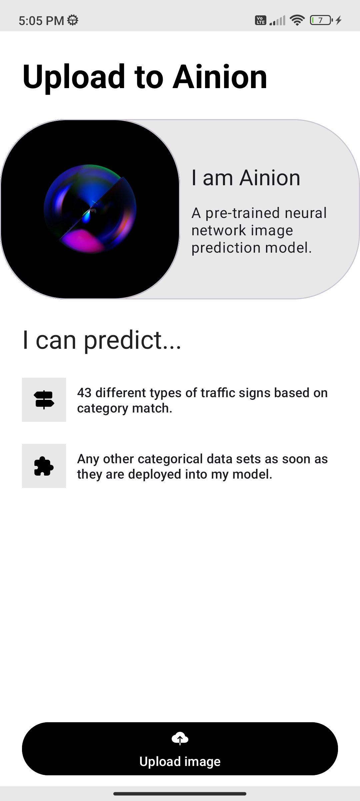
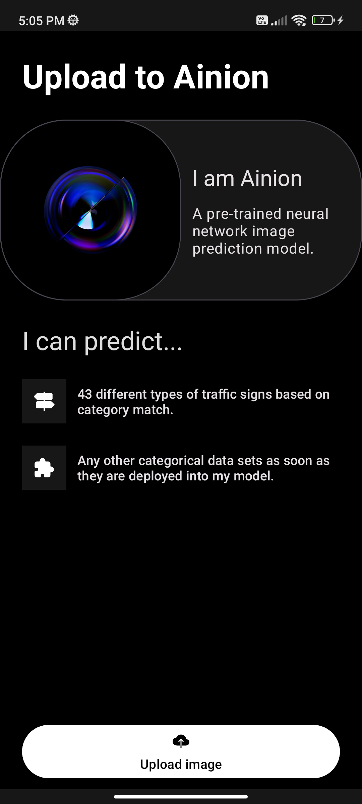
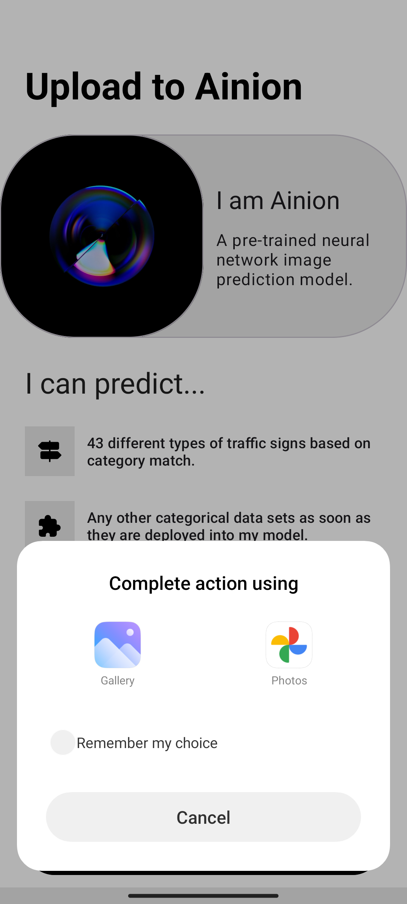
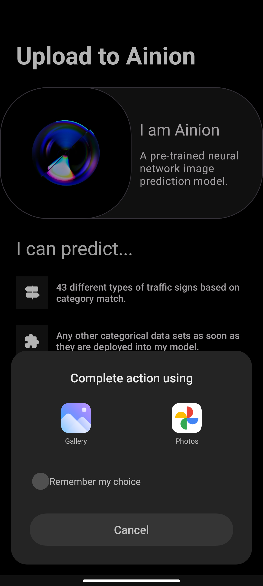
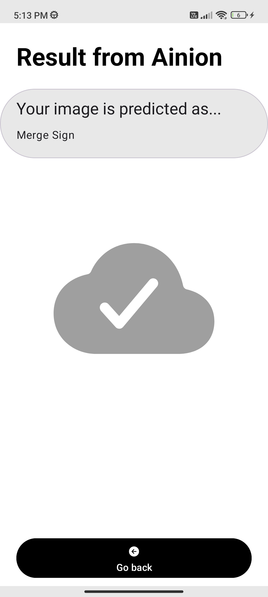
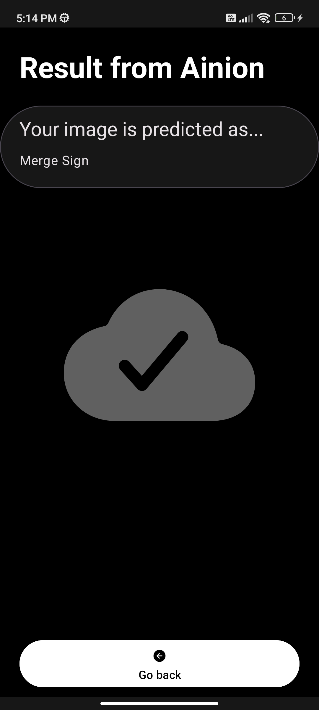

# Ainion
Ainion is a companion app that hooks up with a pre-trained neural network image prediction model to detect 43 different types of traffic signs based on category match and any other categorical data sets to be deployed in the future.
## Screenshots
<table>
  <tr>
    <td>
      
    </td>
    <td>
      
    </td>
    <td>
      
    </td>
    <td>
      
    </td>
    <td>
      
    </td>
    <td>
      
    </td>
    <td>
      
    </td>
    <td>
      
    </td>
  </tr>
</table>

## Author
Seif Elden Abu El-Ela
